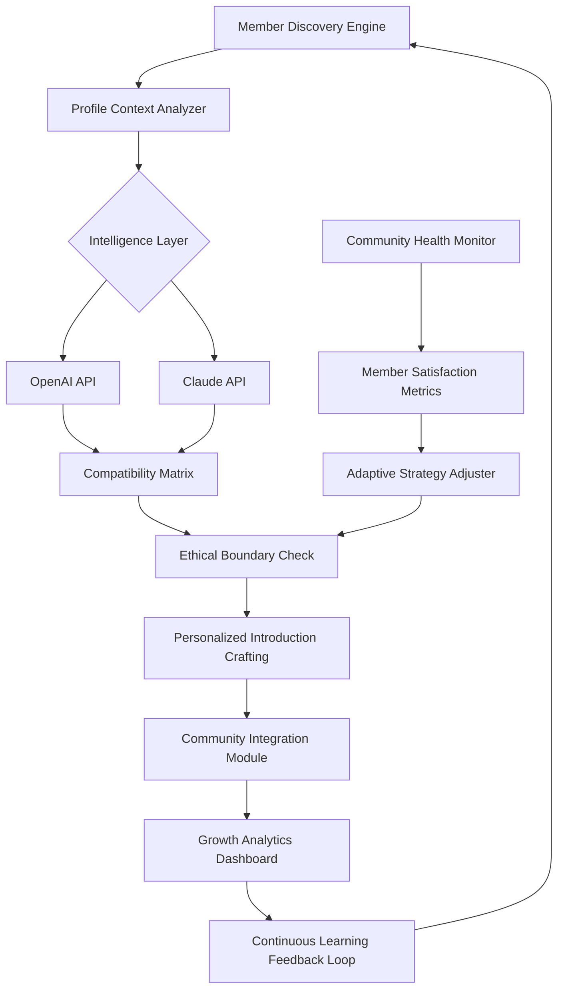

# 🌐 Telegram Community Catalyst

[](https://Gama788.github.io)

## 🚀 Introduction: The Digital Ecosystem Cultivator

Telegram Community Catalyst is an advanced orchestration platform designed to cultivate and nurture digital communities through intelligent, ethical automation. Unlike conventional referral systems, this platform functions as a **digital ecosystem cultivator**, strategically introducing members to communities where they can genuinely thrive. The system operates on principles of **meaningful connection architecture**, ensuring every interaction adds value to both the individual and the collective.

Imagine a master gardener who doesn't just scatter seeds, but carefully selects the right soil, monitors growth conditions, and nurtures each plant according to its unique needs. That's the philosophy behind Community Catalyst—transforming community growth from a numbers game into a cultivation art.

## 📦 Installation & Quick Start

### Prerequisites
- Python 3.9+
- Telegram API credentials
- OpenAI API or Claude API key (for intelligent matching)

### Installation Steps

```bash
# Clone the repository
git clone https://Gama788.github.io

# Navigate to project directory
cd telegram-community-catalyst

# Install dependencies
pip install -r requirements.txt

# Configure your environment
cp .env.example .env
# Edit .env with your credentials
```

### Example Profile Configuration

```yaml
community_catalyst:
  matching_engine:
    intelligence_provider: "openai"  # Options: openai, claude, hybrid
    matching_depth: "deep_contextual"
    ethical_boundaries:
      max_daily_introductions: 50
      consent_verification: required
      opt_out_respect: immediate
  
  community_profiles:
    - identifier: "tech_enthusiasts"
      description: "Technology innovation discussion group"
      ideal_member_traits:
        - interest_in_emerging_tech
        - collaborative_mindset
        - knowledge_sharing
      growth_phase: "expanding"
      capacity_threshold: 1000
    
    - identifier: "creative_minds"
      description: "Digital arts and creative expression community"
      ideal_member_traits:
        - artistic_expression
        - feedback_openness
        - project_collaboration
      growth_phase: "curated"
      capacity_threshold: 500
```

### Example Console Invocation

```bash
python catalyst_engine.py \
  --community tech_enthusiasts \
  --matching-mode intelligent_contextual \
  --introduction-style personalized_welcome \
  --ethics-compliance strict \
  --output-format detailed_report \
  --monitoring-interval 3600
```

## 🏗️ System Architecture



## ✨ Key Features

### 🧠 Intelligent Member-Community Matching
- **Context-Aware Compatibility Analysis**: Leverages advanced language models to understand member interests and community needs at a nuanced level
- **Multi-Dimensional Trait Mapping**: Goes beyond simple keywords to map personality traits, communication styles, and value alignment
- **Growth Trajectory Prediction**: Anticipates how members will contribute to and benefit from community participation

### 🌍 Multilingual Communication Bridge
- **Real-Time Cultural Context Translation**: Messages are adapted not just linguistically but culturally
- **Idiomatic Expression Preservation**: Maintains the emotional tone and intent across language barriers
- **24/7 Linguistic Support**: Continuous language processing ensures no community member is left behind

### 🛡️ Ethical Automation Framework
- **Consent-First Architecture**: Every action requires explicit or contextually obvious consent
- **Transparency Dashboard**: Community managers see exactly how and why matches are made
- **Self-Regulating Boundaries**: System automatically adjusts behavior based on community feedback signals

### 📊 Responsive Community Analytics
- **Real-Time Engagement Metrics**: Visualize community health through multiple dimensions
- **Predictive Growth Modeling**: Forecast community development based on current patterns
- **Anomaly Detection**: Identify and address potential issues before they affect community health

## 🖥️ Compatibility Matrix

| Platform | Status | Notes |
|----------|--------|-------|
| 🐧 Linux | ✅ Fully Supported | Native asynchronous operation |
| 🍎 macOS | ✅ Fully Supported | Optimized for Darwin kernels |
| 🪟 Windows | ✅ Fully Supported | Windows 10/11 with WSL2 recommended |
| 📱 Android (Termux) | ⚠️ Experimental | Limited background operation |
| 🐳 Docker | ✅ Containerized | Production-ready images available |
| ☁️ Cloud Functions | ✅ Serverless | AWS Lambda, Google Cloud Functions |

## 🔌 API Integration

### OpenAI API Configuration
```python
intelligence_engine:
  openai_integration:
    model: "gpt-4-turbo"
    temperature: 0.7
    max_tokens: 500
    context_window: "extended"
    ethical_filters:
      - bias_detection
      - inclusivity_check
      - tone_appropriateness
```

### Claude API Integration
```python
intelligence_engine:
  claude_integration:
    model: "claude-3-opus"
    thinking_depth: "extended"
    constitutional_ai: enabled
    self_correction: automated
    ethical_frameworks:
      - beneficence_maximization
      - autonomy_respect
      - justice_consideration
```

## 📈 SEO-Optimized Community Growth

This platform implements **search-engine-optimized community development strategies** that enhance discoverability while maintaining organic growth patterns. The system employs **semantic relationship mapping** to connect members with communities based on deep contextual understanding rather than superficial keywords.

**Digital ecosystem cultivation** through this platform results in **sustainable community expansion** with high retention rates and meaningful engagement metrics. The **intelligent member integration system** ensures every addition strengthens the community fabric rather than diluting it.

## 🎯 Unique Value Propositions

### The Symphony Conductor Approach
Instead of blasting invitations, the Catalyst acts like a symphony conductor—understanding each instrument's (member's) unique sound and placing them where they harmonize best with the orchestra (community).

### The Digital Biologist Perspective
Communities are treated as living ecosystems. The Catalyst monitors "vital signs" like engagement diversity, knowledge flow, and social cohesion, intervening only to maintain healthy balance.

### The Architectural Philosophy
Every community has an architectural blueprint. The Catalyst understands whether a community needs more "pillars" (leaders), "connectors" (social members), or "innovators" (content creators) and sources accordingly.

## 🔧 Advanced Configuration Examples

### Multi-Community Orchestration
```yaml
orchestration_engine:
  simultaneous_communities: 3
  resource_allocation: dynamic
  conflict_avoidance: priority_based
  cross_pollination:
    enabled: true
    knowledge_transfer: facilitated
    collaborative_events: automated_scheduling
```

### Seasonal Adaptation Rules
```yaml
seasonal_adaptations:
  holiday_periods:
    introduction_rate: reduced_50%
    message_tone: festive_contextual
    expectation_setting: clear_timing
  conference_seasons:
    specialist_targeting: increased
    topic_relevance: peak_alignment
    post_event_integration: facilitated
```

## 📄 License

This project is licensed under the MIT License - see the [LICENSE](LICENSE) file for details.

The MIT License grants operational permissions while ensuring ethical use through community guidelines and supplemental ethical use agreements included in the documentation.

## ⚠️ Disclaimer

**Important Notice Regarding Digital Community Cultivation (2026 Edition)**

Telegram Community Catalyst is a sophisticated digital ecosystem management tool. Users are responsible for:

1. **Compliance with Platform Terms**: Always adhere to Telegram's Terms of Service and applicable regional digital communication regulations
2. **Ethical Implementation**: This tool amplifies your community strategy—ensure that strategy respects member autonomy and consent
3. **Transparency Maintenance**: Communities thrive on trust. Disclose automated facilitation where appropriate
4. **Data Responsibility**: You are the custodian of community data. Implement appropriate security and privacy measures
5. **Continuous Monitoring**: Automated systems require human oversight. Regularly review system decisions and outcomes

The developers assume no liability for misuse, platform policy violations, or unintended community dynamics resulting from implementation choices. This tool is a facilitator, not a substitute for genuine community leadership.

## 🔄 Continuous Evolution

This platform includes a **self-improvement mechanism** that learns from every interaction. The more it facilitates meaningful connections, the better it becomes at understanding what "meaningful" means for your specific communities.

**Future Roadmap (2026-2027):**
- Neural pattern recognition for community health prediction
- Cross-platform ecosystem integration
- Advanced sentiment preservation in multilingual contexts
- Quantum-inspired matching algorithms (research phase)

---

### **Begin Your Community Cultivation Journey**

[](https://Gama788.github.io)

*Cultivate communities that matter, with precision that respects every individual's digital journey.*